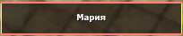
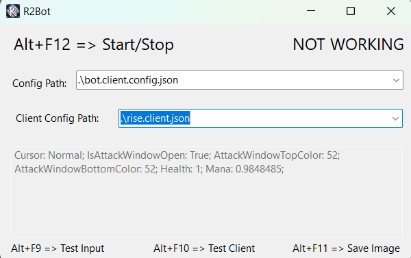
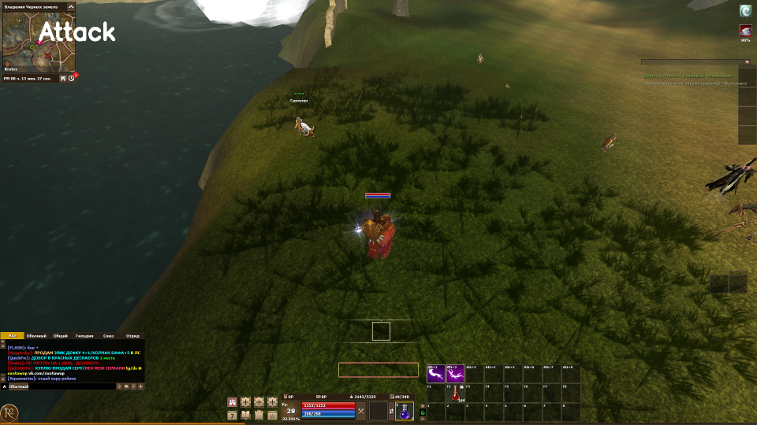
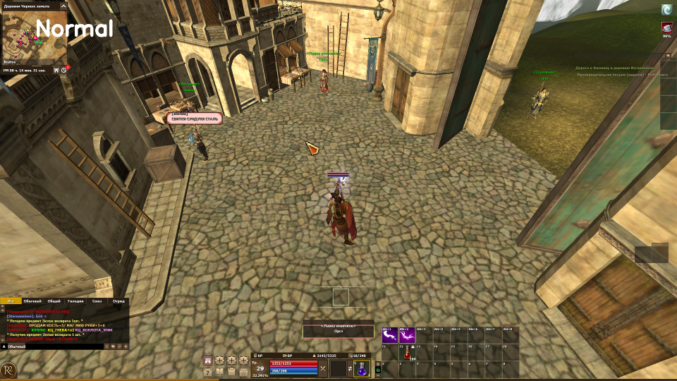

# Установка

1. Скачать и распаковать программу
2. Установить драйвер эмуляции ввода. 
   1. Эмуляция будет работать только если подключено устройство ввода USB.
   2. Драйвер будет выгружен после отключения устройства USB, иногда не запускается правильно и требуется перезагрузка ПК.
   3. Запустить от имени администратора файл "Driver/Driver/InstallDriver.bat"
   4. Перезагрузить ПК.


# Настройка
Бот пиксельный поэтому ему для работы нужно знать где на экране что расположено. 
Бот расчитан на работу на экране 1920x1080 (с другими не проверял, но по идеи работать будет)

Файлы по-умолчанию будут созданы при первом запуске мобов.

Необходимо однократно адаптировать бота к клиенту R2, путем настройки областей анализа (описаны ниже). Для адаптации к клиенту используются файлы с расширением "*.client.json".

Для настройки параметров бота используются файлы с расширением "*.config.json".

## Настройка клиента R2
Все настройки на минимум.
Все галки снять.
Текстуры должны быть минимального качества.

## Адаптация к клиенту R2

> Режим адаптации находится в разработке, поэтому лучше после адаптации перезапустить бота

Для адаптации к клиенту R2 вам понадобится программа для работы с изображением (Paint или Paint.Net).

Необходимо создать себе копию файла "default.client.json" и настроить в соответствии с текущим клиентом R2. Для этого используйте режим сохранения изображений Alt + F11 и режим тестирования клиента Alt + F10. В режиме тестирования клиента, каждое последнее изображение сохраняется в директории с именем "test_client.png".

Задаваемые ниже прямоугольники имеют следующую нотацию: (x, y, width, height):
- x, y --- точка начала прямоугольника
- width, height --- ширина и высота прямоугольника

Необходимо настроить следующие области:
- мана (ManaRectangle): прямоугольник 2-3 пикселя окна MP
- здоровье (HealthRectangle): прямоугольник 2-3 пикселя окна HP
- область окна атаки (AttackWindowRectangle): прямоугольник, который указывает область окна атаки
  - верхняя граница окна атаки (AttackWindowTopEdgeRectangle): необходимо задать ширину области внутри окна атаки (край окна) -- как правило это прямоугольник высотой 1 пиксель и длиной как у окна атаки 
  - нижняя граница окна атаки (AttackWindowBottomEdgeRectangle): тоже самое что и верхняя граница, только нужно сделать правильный отступ
- область курсора (CursorRect): как правило не трогаем, выбран прямоугольник относительно курсора, который имеет одиннаковый цвет.

Теперь нужно задать правильные цвета.

Необходимо настроить следующие цвета:
- интенсивность цвета границ окна атаки (AttackWindowColor): если вы правильно настроили границы, то этот параметр будет выведен в лог при нажатии Alt+F10. Значения AttackWindowTopColor и AttackWindowBottomColor должны совпадать между собой, проверьте несколько раз 
- цвета курсоров --- для этого следует в интерфейсе выбрать тип курсора и нажать Alt-F9. Необходимо проверить, что программа выдаст вам сообщение о том, что конфиг перезаписан. После этого следует проверить курсор через Alt+F10. Необходимо обновить:
  - курсор атаки
  - курсор поднятия предмета
  - курсор запрета атаки
  - курсор взятия предмета

Теперь пора проверить правильно ли вы все настроили. 
Нужно проверить правильно ли бот распознает курсоры и верно ли определяется окно атаки и уровни маны/здоровья.

В игре нажмите Alt+F10 и просто проверяйте что вам выдаст лог и текст на картинки, примеры ниже.

 

## Настройка бота
Настройка осуществляется в файлах "*.config.json".
Я просто прокомментирую поля, настраивайте дальше под себя.
> Желательно избегать клавиш F9 - F12

В боте есть режим игнорирования тотема жизни, но он пока плохо работает, пока выключен.

```json
{
  "TpKey": "Q", // На какую кнопку ТП
  "TpThreshold": 0.4, // Уровень жизни после которого жмется ТП
  "HpKey": "F1", // Хилки
  "HpThreshold": 0.6, // Порог хилок
  "HpSkillThreshold": 0.8, // Порог применения навыков восстановления жизни (тотем)
  "ManaThreshold": 0.4, // Порог маны
  "NumberFailedSearchBeforeMove": 7, // Сколько должно пройти поисков (проваленных) прежде чем повернуть камеру
  "IsLuringEnabled": true, // спец режим для призывателей, собирает мобов через огонь или бездну
  "IsTakeEnabled": true, // Поднимать ли предметы
  "MoveAfterEachKill": false, // Поворачивать камеру после каждого убийства
  "RotateDelayMs": 0, // Сколько нажимать поворот - настраивайте под себя
  "MaxAttackTime": "00:02:00", // Если атака больше 2минут, сбросить ее (перс застрял)
  "AllSkills": [ // Описание скилов
    {
      "SkillType": "Attack", // тип скилла, может быть Attack, HP, Buff, Luring, Special
      "Key": "One", // Клавиша на которой скил
      "Delay": "00:00:07", // Задержка применения
      "Timestamp": null, 
      "Threshold": 0.0, 
      "ExecutionMs": 0 // Время каста (если скилл блокирует выполнение действий)
    },
    {
      "SkillType": "Attack",
      "Key": "Two",
      "Delay": "00:00:07",
      "Timestamp": null,
      "Threshold": 0.0,
      "ExecutionMs": 1500
    },
    {
      "SkillType": "Luring",
      "Key": "Three",
      "Delay": "00:00:35",
      "Timestamp": null,
      "Threshold": 0.0,
      "ExecutionMs": 1500
    },
    {
      "SkillType": "HP", // Тотем жизни
      "Key": "Four",
      "Delay": "00:03:00",
      "Timestamp": null,
      "Threshold": 0.0,
      "ExecutionMs": 1000
    },
    {
      "SkillType": "Buff", // Всякие бафы, при старте нажмет их принудительно
      "Key": "F2",
      "Delay": "00:09:00",
      "Timestamp": null,
      "Threshold": 0.0,
      "ExecutionMs": 3000
    },
    {
      "SkillType": "Buff",
      "Key": "F3",
      "Delay": "00:09:00",
      "Timestamp": null,
      "Threshold": 0.0,
      "ExecutionMs": 3000
    },
    {
      "SkillType": "Buff",
      "Key": "F4",
      "Delay": "02:00:00",
      "Timestamp": null,
      "Threshold": 0.0,
      "ExecutionMs": 0
    },
    {
      "SkillType": "Buff",
      "Key": "F5",
      "Delay": "00:15:00",
      "Timestamp": null,
      "Threshold": 0.0,
      "ExecutionMs": 0
    },
    {
      "SkillType": "Buff",
      "Key": "F7",
      "Delay": "00:45:00",
      "Timestamp": null,
      "Threshold": 0.0,
      "ExecutionMs": 0
    }
  ]
}
```

# Возможные проблемы

> Запускаю бота в игре, а он ничего не делает.

Перезагрузить ПК и проверить установку драйверов. Иногда слетают.

> Бот сразу делает ТП

Неправильно настроены области поиска или выбран не тот конфиг.